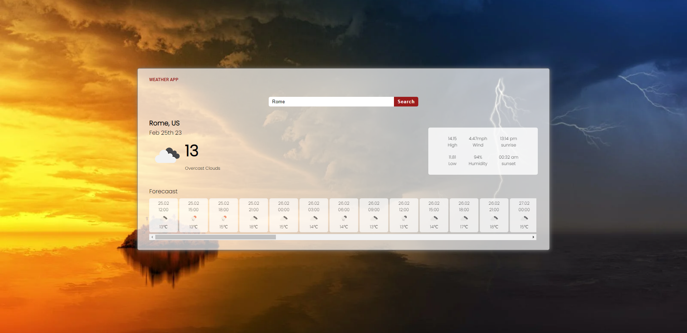
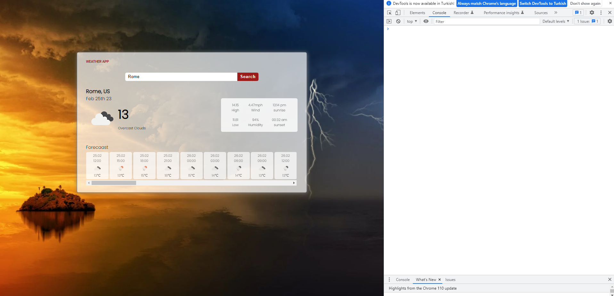
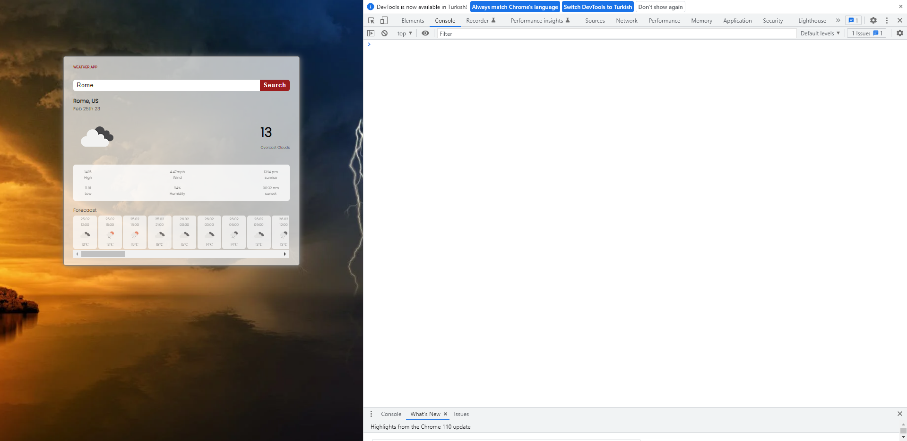
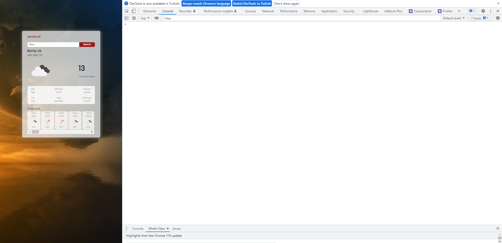

# Getting Started with Create React App

This project was bootstrapped with [Create React App](https://github.com/facebook/create-react-app).

## Available Scripts

In the project directory, you can run:

### How to work this project 

- Open *[this project](https://charming-maamoul-27e2c6.netlify.app/)* to view it in your browser or 
- `git clone https://github.com/fahriakbaba/Weather-App.git`
- `npm install`
- `npm start`

